# 奥地利市场模拟器 - 架构依赖分析报告

## 1. 包结构概览

| 包名 | 包含的核心类型 |
|------|---------------|
| `entity` | NormalDistribution |
| `logging` | LOGGER, Logger, MYSQL_POOL, AgentCashLog, AgentDemandRemovalLog ... (共 9 个) |
| `model` | Agent, IntervalRelation, TradeResult, Preference, Factory ... (共 11 个) |

## 2. 文件结构概览

| 文件路径 | 包含的核心类型 |
|---------|---------------|
| `src/entity/normal_distribute.rs` | NormalDistribution |
| `src/logging.rs` | LOGGER, Logger, MYSQL_POOL |
| `src/logging/agent_cash_log.rs` | AgentCashLog |
| `src/logging/agent_demand_removal_log.rs` | AgentDemandRemovalLog |
| `src/logging/agent_range_adjustment_log.rs` | AgentRangeAdjustmentLog |
| `src/logging/factory_end_of_round_log.rs` | FactoryEndOfRoundLog |
| `src/logging/factory_range_optimization_log.rs` | FactoryRangeOptimizationLog |
| `src/logging/trade_log.rs` | TradeLog |
| `src/model/agent.rs` | Agent, IntervalRelation, TradeResult |
| `src/model/agent/preference.rs` | Preference |
| `src/model/factory.rs` | Factory, FactoryStatus |
| `src/model/factory/accountant.rs` | Accountant |
| `src/model/factory/financial_bill.rs` | FinancialBill |
| `src/model/market.rs` | Market |
| `src/model/product.rs` | Product, ProductCategory |

## 3. 文件级别依赖关系

| 文件路径 | 包含依赖数 (owns) | 使用依赖数 (uses) | 总依赖数 |
|---------|-----------------|-----------------|---------|
| `src/entity.rs` | 1 | 0 | 1 |
| `src/lib.rs` | 0 | 4 | 4 |
| `src/logging.rs` | 6 | 9 | 15 |
| `src/logging/agent_range_adjustment_log.rs` | 0 | 2 | 2 |
| `src/logging/factory_range_optimization_log.rs` | 0 | 1 | 1 |
| `src/logging/trade_log.rs` | 0 | 3 | 3 |
| `src/model.rs` | 5 | 0 | 5 |
| `src/model/agent.rs` | 1 | 5 | 6 |
| `src/model/agent/preference.rs` | 0 | 3 | 3 |
| `src/model/factory.rs` | 2 | 8 | 10 |
| `src/model/factory/accountant.rs` | 0 | 1 | 1 |
| `src/model/market.rs` | 0 | 7 | 7 |
| `src/model/product.rs` | 0 | 1 | 1 |

## 4. 文件依赖关系图 (Mermaid)

```mermaid
flowchart TD
    classDef file fill:#f9f,stroke:#333,stroke-width:2px;
    file_0_entity.rs["entity.rs"]
    file_1_lib.rs["lib.rs"]
    file_2_trade_log.rs["trade_log.rs"]
    file_3_market.rs["market.rs"]
    file_4_math.rs["math.rs"]
    file_5_agent_range_adjustment_log.rs["agent_range_adjustment_log.rs"]
    file_6_accountant.rs["accountant.rs"]
    file_7_agent.rs["agent.rs"]
    file_8_factory.rs["factory.rs"]
    file_9_logging.rs["logging.rs"]
    file_10_preference.rs["preference.rs"]
    file_11_factory_end_of_round_log.rs["factory_end_of_round_log.rs"]
    file_12_product.rs["product.rs"]
    file_13_agent_cash_log.rs["agent_cash_log.rs"]
    file_14_financial_bill.rs["financial_bill.rs"]
    file_15_normal_distribute.rs["normal_distribute.rs"]
    file_16_factory_range_optimization_log.rs["factory_range_optimization_log.rs"]
    file_17_agent_demand_removal_log.rs["agent_demand_removal_log.rs"]
    file_18_model.rs["model.rs"]
    file_0_entity.rs -->|owns| file_15_normal_distribute.rs
    file_1_lib.rs -.->|uses| file_12_product.rs
    file_1_lib.rs -.->|uses| file_15_normal_distribute.rs
    file_1_lib.rs -.->|uses| file_9_logging.rs
    file_1_lib.rs -.->|uses| file_3_market.rs
    file_9_logging.rs -->|owns| file_11_factory_end_of_round_log.rs
    file_9_logging.rs -->|owns| file_5_agent_range_adjustment_log.rs
    file_9_logging.rs -->|owns| file_17_agent_demand_removal_log.rs
    file_9_logging.rs -->|owns| file_13_agent_cash_log.rs
    file_9_logging.rs -->|owns| file_2_trade_log.rs
    file_9_logging.rs -->|owns| file_16_factory_range_optimization_log.rs
    file_9_logging.rs -.->|uses| file_11_factory_end_of_round_log.rs
    file_9_logging.rs -.->|uses| file_5_agent_range_adjustment_log.rs
    file_9_logging.rs -.->|uses| file_7_agent.rs
    file_9_logging.rs -.->|uses| file_17_agent_demand_removal_log.rs
    file_9_logging.rs -.->|uses| file_12_product.rs
    file_9_logging.rs -.->|uses| file_13_agent_cash_log.rs
    file_9_logging.rs -.->|uses| file_8_factory.rs
    file_9_logging.rs -.->|uses| file_2_trade_log.rs
    file_9_logging.rs -.->|uses| file_16_factory_range_optimization_log.rs
    file_5_agent_range_adjustment_log.rs -.->|uses| file_12_product.rs
    file_5_agent_range_adjustment_log.rs -.->|uses| file_7_agent.rs
    file_16_factory_range_optimization_log.rs -.->|uses| file_9_logging.rs
    file_2_trade_log.rs -.->|uses| file_12_product.rs
    file_2_trade_log.rs -.->|uses| file_8_factory.rs
    file_2_trade_log.rs -.->|uses| file_7_agent.rs
    file_18_model.rs -->|owns| file_7_agent.rs
    file_18_model.rs -->|owns| file_12_product.rs
    file_18_model.rs -->|owns| file_8_factory.rs
    file_18_model.rs -->|owns| file_3_market.rs
    file_18_model.rs -->|owns| file_4_math.rs
    file_7_agent.rs -->|owns| file_10_preference.rs
    file_7_agent.rs -.->|uses| file_12_product.rs
    file_7_agent.rs -.->|uses| file_8_factory.rs
    file_7_agent.rs -.->|uses| file_4_math.rs
    file_7_agent.rs -.->|uses| file_9_logging.rs
    file_7_agent.rs -.->|uses| file_10_preference.rs
    file_10_preference.rs -.->|uses| file_12_product.rs
    file_10_preference.rs -.->|uses| file_15_normal_distribute.rs
    file_10_preference.rs -.->|uses| file_7_agent.rs
    file_8_factory.rs -->|owns| file_6_accountant.rs
    file_8_factory.rs -->|owns| file_14_financial_bill.rs
    file_8_factory.rs -.->|uses| file_6_accountant.rs
    file_8_factory.rs -.->|uses| file_7_agent.rs
    file_8_factory.rs -.->|uses| file_12_product.rs
    file_8_factory.rs -.->|uses| file_4_math.rs
    file_8_factory.rs -.->|uses| file_14_financial_bill.rs
    file_8_factory.rs -.->|uses| file_15_normal_distribute.rs
    file_8_factory.rs -.->|uses| file_9_logging.rs
    file_8_factory.rs -.->|uses| file_16_factory_range_optimization_log.rs
    file_6_accountant.rs -.->|uses| file_14_financial_bill.rs
    file_3_market.rs -.->|uses| file_7_agent.rs
    file_3_market.rs -.->|uses| file_12_product.rs
    file_3_market.rs -.->|uses| file_8_factory.rs
    file_3_market.rs -.->|uses| file_4_math.rs
    file_3_market.rs -.->|uses| file_14_financial_bill.rs
    file_3_market.rs -.->|uses| file_9_logging.rs
    file_3_market.rs -.->|uses| file_10_preference.rs
    file_12_product.rs -.->|uses| file_15_normal_distribute.rs
```



## 5. 核心类依赖详情

### AgentRangeAdjustmentLog

**使用 (uses):**
- `Agent` (model)

### Agent

**使用 (uses):**
- `Preference` (model)
- `ProductCategory` (model)

### Preference

**使用 (uses):**
- `Agent` (model)

### Factory

**使用 (uses):**
- `FactoryStatus` (model)
- `Accountant` (model)
- `ProductCategory` (model)

### Accountant

**使用 (uses):**
- `FinancialBill` (model)

### Market

**使用 (uses):**
- `Agent` (model)
- `Factory` (model)
- `Product` (model)

### Product

**使用 (uses):**
- `NormalDistribution` (entity)
- `ProductCategory` (model)

## 6. 类依赖关系图 (Mermaid)

```mermaid
flowchart TD
    classDef struct fill:#f9f,stroke:#333,stroke-width:2px;
    classDef enum fill:#fcf,stroke:#333,stroke-width:2px;
    classDef trait fill:#cff,stroke:#333,stroke-width:2px;
    class_0_NormalDistribution["NormalDistribution"]
    class_1_LOGGER["LOGGER"]
    class_2_Logger["Logger"]
    class_3_MYSQL_POOL["MYSQL_POOL"]
    class_4_AgentCashLog["AgentCashLog"]
    class_5_AgentDemandRemovalLog["AgentDemandRemovalLog"]
    class_6_AgentRangeAdjustmentLog["AgentRangeAdjustmentLog"]
    class_7_FactoryEndOfRoundLog["FactoryEndOfRoundLog"]
    class_8_FactoryRangeOptimizationLog["FactoryRangeOptimizationLog"]
    class_9_TradeLog["TradeLog"]
    class_10_Agent["Agent"]
    class_11_IntervalRelation["IntervalRelation"]
    class_12_TradeResult["TradeResult"]
    class_13_Preference["Preference"]
    class_14_Factory["Factory"]
    class_15_FactoryStatus["FactoryStatus"]
    class_16_Accountant["Accountant"]
    class_17_FinancialBill["FinancialBill"]
    class_18_Market["Market"]
    class_19_Product["Product"]
    class_20_ProductCategory["ProductCategory"]
    class_6_AgentRangeAdjustmentLog -.->|use| class_10_Agent
    class_10_Agent -.->|use| class_13_Preference
    class_10_Agent -.->|use| class_20_ProductCategory
    class_13_Preference -.->|use| class_10_Agent
    class_14_Factory -.->|use| class_20_ProductCategory
    class_14_Factory -.->|use| class_16_Accountant
    class_14_Factory -.->|use| class_15_FactoryStatus
    class_16_Accountant -.->|use| class_17_FinancialBill
    class_18_Market -.->|use| class_10_Agent
    class_18_Market -.->|use| class_14_Factory
    class_18_Market -.->|use| class_19_Product
    class_19_Product -.->|use| class_20_ProductCategory
    class_19_Product -.->|use| class_0_NormalDistribution
```



## 7. 循环依赖分析

### 文件级循环依赖

**循环 1:**
`agent.rs` → `factory.rs` → `agent.rs`

**循环 2:**
`logging.rs` → `agent_range_adjustment_log.rs` → `agent.rs` → `factory.rs` → `logging.rs`

**循环 3:**
`logging.rs` → `agent_range_adjustment_log.rs` → `agent.rs` → `factory.rs` → `factory_range_optimization_log.rs` → `logging.rs`

**循环 4:**
`logging.rs` → `agent_range_adjustment_log.rs` → `agent.rs` → `logging.rs`

**循环 5:**
`agent.rs` → `preference.rs` → `agent.rs`

### 类级循环依赖

**循环 1:**
`Agent` → `Preference` → `Agent`

## 8. 模块结构总结

```
austrian_market_sim
├── src
│   ├── entity
│   │   └── normal_distribute.rs
│   ├── logging
│   │   ├── agent_cash_log.rs
│   │   ├── agent_demand_removal_log.rs
│   │   ├── agent_range_adjustment_log.rs
│   │   ├── factory_end_of_round_log.rs
│   │   ├── factory_range_optimization_log.rs
│   │   ├── trade_log.rs
│   │   └── mod.rs
│   ├── model
│   │   ├── agent
│   │   │   ├── preference.rs
│   │   │   └── mod.rs
│   │   ├── factory
│   │   │   ├── accountant.rs
│   │   │   ├── financial_bill.rs
│   │   │   └── mod.rs
│   │   ├── market.rs
│   │   ├── math.rs
│   │   ├── product.rs
│   │   └── mod.rs
│   ├── util
│   │   └── mod.rs
│   ├── lib.rs
│   └── main.rs
```
